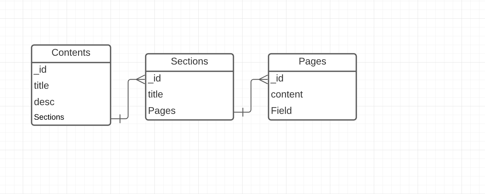

# Ozgur Yazar | Server

This is a learn project about book blog.

## Technologies

- Node js
- Mongodb

## Endpoints & Services

---

### Auth Service:

- [x] POST /auth/login
- [x] POST /auth/register / TEMP

### Admin Service:

- [x] GET /admin/contents
- [ ] GET /admin/contents/:id
- [x] POST /admin/contents/new
- [ ] PATCH /admin/contents/:content_id
- [ ] POST /admin/contents/newSection/:content_id
- [ ] POST /admin/contents/newPage/:section_id
- [ ] PATCH /admin/contents/newPage/:section_id

## Public Service:

- [ ] GET /contents
- [ ] GET /contents/:id

---

### Json data:

```json
{
	"_id": "61fac67094a24ed5485ef730",
	"title": "Selam",
	"desc": "<p>Selam</p>",
	"published": false,
	"sections": [
		{
			"title": "Bolum 1",
			"published": false,
			"pages": [
				{
					"content": "<p>lorem</p>",
					"_id": "61fac67094a24ed5485ef72d",
					"createdAt": "2022-02-02T17:59:12.206Z",
					"updatedAt": "2022-02-02T17:59:12.206Z"
				}
			],
			"_id": "61fac67094a24ed5485ef72e",
			"createdAt": "2022-02-02T17:59:12.207Z",
			"updatedAt": "2022-02-02T17:59:12.207Z"
		}
	],
	"createdAt": "2022-02-02T17:59:12.207Z",
	"updatedAt": "2022-02-02T17:59:12.207Z"
}
```

### Notes:

- Her içerik yaratılırken 1 adet bölümü olucak
- Her bölüm oluştuğunda bir adet sayfası olucak
- Her sayfaya kelime limiti konucak
- Yeni sayfa oluşturmak için butona basılıcak
- Errorları logger ile handle et

### Data model:


